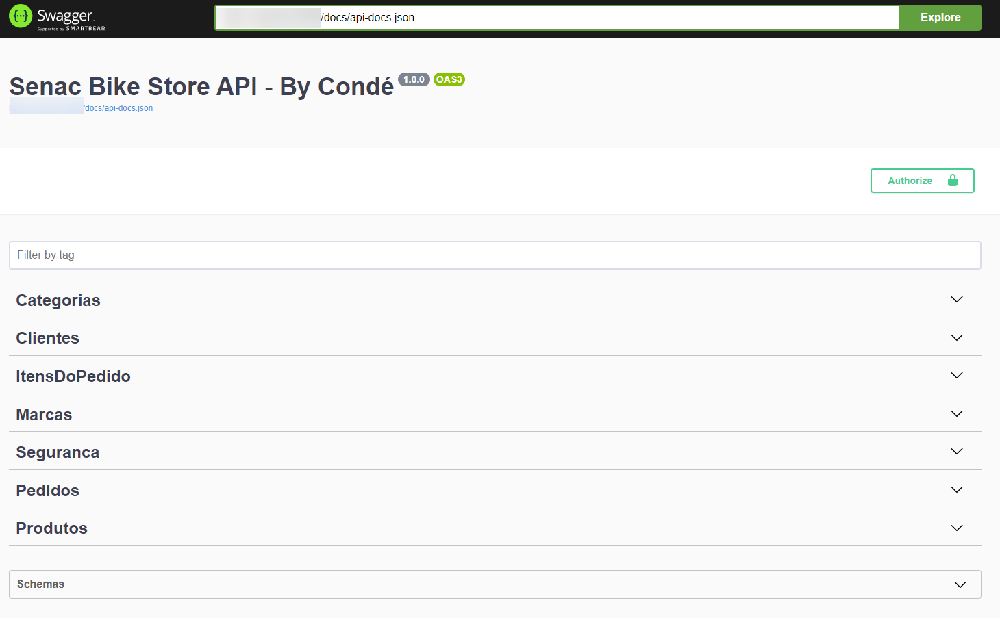

# Visão Geral
Este é um projeto de demonstração de desenvolvimento de API WS Rest em Laravel. 

Este projeto implementa um conjunto de funcionalidades que foram exibidas ao longo da disciplina de Desenvolvimento de Web Services do curso de Tecnologia de Sistemas de Internet da Universidade SENAC.

# Autor
Luciano Condé de Souza (luconde@gmail.com)

Data: 2023-04-18

## Disclaimer
O seguinte material foi construído a partir de referências publicadas na Internet, livros e artigos acadêmicos. As referências foram utilizadas de sites e posts na Internet, não há qualquer propósito de plagiar os autores, em caso de pedidos de adição do autor, pode encontrar em contato pelo email luconde@gmail.com. A simplificação de certos conteúdos tem o único propósito didático para facilitar o entendimento dos mesmos para os alunos. 

# Notas da versão
## Versão 1.0
1. Publicação do conteúdo

### Notas técnicas
1. A funcionalidade Passport do Laravel foi utilizada para implementar o mecanismo de autenticação via Bearer Token. Assim sendo, para qualquer chamada é necessário adicionar o token (oriundo do WebService login) no cabeçalho da chamada.
2. A funcionalidade L5-Swagger do Laravel foi utilizada para implementar a documentação em formato Swagger. Os detalhes estão escritos dentro do próprio código, criando assim uma boa prática para documentação.
3. O banco de dados e os seus dados utilizado pode ser encontrado na pasta "database". O SGDB utilizado é o MySQL da Oracle.
4. Para executar o Docker é necessário ter o Docker Desktop instalado previamente.
5. Para executar o Kubernetes no OCI é necessário ter uma assinatura do Oracle Cloud Infrastructure previamente.

# Detalhes técnicos
## Estrutura de diretórios
1. database: Dump do banco de dados MySQL
2. application: Código-fonte da aplicação Laravel/PHP
3. infra: Arquivos utilizados para demonstração de uso de Docker & Kubernetes no OCI

## Funcionalidades
1. CRUD para a tabela de categoria
2. CRUD para a tabela de marca
3. CRUD para a tabela de produtos
4. CRUD para a tabela de clientes
5. CRUD para as tabelas de pedidos & itens de pedidos
6. Ordenação no resultado da tabela de categoria
7. Ordenação no resultado da tabela de cliente
8. Ordenação no resultado da tabela de marca
9. Ordenação no resultado da tabela de pedidos
10. Ordenação no resultado da tabela de pedidos
11. Paginação no resultado da tabela de pedidos
12. Filtro no resultado da tabela de pedidos
13. Execução em Docker (opcional)
14. Execução em Kubernetes no Oracle Cloud Infrastructure (OCI) (opcional)

## Pré-requisitos
1. Visual Studio Code
2. PHP
3. Framework Laravel instalado
4. MySQL
5. Banco previamente preenchido

# Informações adicionais
## Canvas dos WebServices
| Item            | Objetivo                                | Ação        | Verbo  | Parâmetros - Query                                          | Parâmetros - Path        | Parâmetros - Corpo | Parâmetros - Cabeçalho | Saída                                   | Url                                                      |
|-----------------|-----------------------------------------|-------------|--------|-------------------------------------------------------------|--------------------------|--------------------|------------------------|-----------------------------------------|----------------------------------------------------------|
| Categoria       | Listar as categorias                    | Leitura     | GET    | ordenacao (opcional)                                        |                          |                    | token de autenticação  | Lista de Categorias                     | GET /api/categorias                                      |
| Categoria       | Obter os detalhes de uma categoria      | Leitura     | GET    |                                                             | id da categoria          |                    | token de autenticação  | Exibir os dados de uma categoria        | GET /api/categorias/{id}                                 |
| Categoria       | Inserir uma nova categoria              | Inserção    | POST   |                                                             |                          | dados da categoria | token de autenticação  | Exibir os dados da categoria inserida   | POST /api/categorias                                     |
| Categoria       | Atualizar os dados de uma categoria     | Atualização | PATCH  |                                                             | id da categoria          | dados da categoria | token de autenticação  | Exibir os dados da categoria atualizada | PATCH /api/categorias/{id}                               |
| Categoria       | Apagar os dados de uma categoria        | Exclusão    | DELETE |                                                             | id da categoria          |                    | token de autenticação  | Exibir os dados da categoria apagado    | DELETE /api/categorias/{id}                              |
| Clientes        | Listar as clientes                      | Leitura     | GET    | ordenacao (opcional)                                        |                          |                    | token de autenticação  | Lista de Clientes                       | GET /api/clientes                                        |
| Clientes        | Obter os detalhes de um cliente         | Leitura     | GET    |                                                             | id do cliente            |                    | token de autenticação  | Exibir os dados de um cliente           | GET /api/clientes/{id}                                   |
| Clientes        | Inserir um novo cliente                 | Inserção    | POST   |                                                             |                          | dados do cliente   | token de autenticação  | Exibir os dados do cliente inserido     | POST /api/clientes                                       |
| Clientes        | Atualizar os dados de um cliente        | Atualização | PATCH  |                                                             | id do cliente            | dados do cliente   | token de autenticação  | Exibir os dados do cliente atualizado   | PATCH /api/clientes/{id}                                 |
| Clientes        | Apagar os dados de um cliente           | Exclusão    | DELETE |                                                             | id do cliente            |                    | token de autenticação  | Exibir os dados do cliente apagado      | DELETE /api/clientes/{id}                                |
| Marcas          | Listar as marcas                        | Leitura     | GET    | ordenacao (opcional)                                        |                          |                    | token de autenticação  | Lista de Marcas                         | GET /api/marcas                                          |
| Marcas          | Obter os detalhes de uma marca          | Leitura     | GET    |                                                             | id da marca              |                    | token de autenticação  | Exibir os dados de uma marca            | GET /api/marcas/{id}                                     |
| Marcas          | Inserir uma nova marca                  | Inserção    | POST   |                                                             |                          | dados da marca     | token de autenticação  | Exibir os dados da marca inserida       | POST /api/marcas                                         |
| Marcas          | Atualizar os dados de uma marca         | Atualização | PATCH  |                                                             | id da marca              | dados da marca     | token de autenticação  | Exibir os dados da marca atualizada     | PATCH /api/marcas/{id}                                   |
| Marcas          | Apagar os dados de uma marca            | Exclusão    | DELETE |                                                             | id da marca              |                    | token de autenticação  | Exibir os dados da marca apagada        | DELETE /api/marcas/{id}                                  |
| Produtos        | Listar os produtos                      | Leitura     | GET    | ordenacao (opcional),  filtro (opcional), pagina (opcional) |                          |                    | token de autenticação  | Lista de Produtos                       | GET /api/produtos                                        |
| Produtos        | Obter os detalhes de um produto         | Leitura     | GET    |                                                             | id do produto            |                    | token de autenticação  | Exibir os dados de um produto           | GET /api/produtos/{id}                                   |
| Produtos        | Inserir um novo produto                 | Inserção    | POST   |                                                             |                          | dados do produto   | token de autenticação  | Exibir os dados do produto inserido     | POST /api/produtos                                       |
| Produtos        | Atualizar os dados de um produto        | Atualização | PATCH  |                                                             | id do produto            | dados do produto   | token de autenticação  | Exibir os dados do produto atualizado   | PATCH /api/produtos/{id}                                 |
| Produtos        | Apagar os dados de um produto           | Exclusão    | DELETE |                                                             | id da produto            |                    | token de autenticação  | Exibir os dados do produto apagado      | DELETE /api/produtos/{id}                                |
| Pedidos         | Listar os pedidos de um cliente         | Leitura     | GET    | ordenacao (opcional)                                        | id do cliente            |                    | token de autenticação  | Lista de Pedidos de um cliente          | GET /api/clientes/{id}/pedidos                           |
| Pedidos         | Obter os detalhes de um pedido          | Leitura     | GET    |                                                             | id do pedido             |                    | token de autenticação  | Exibir os dados de um pedido            | GET /api/pedidos/{id}                                    |
| Pedidos         | Inserir um novo pedido                  | Inserção    | POST   |                                                             | id do cliente            | dados do pedido    | token de autenticação  | Exibir os dados do pedido inserido      | POST /api/clientes/{id}/pedidos                          |
| Pedidos         | Atualizar os dados de um pedido         | Atualização | PATCH  |                                                             | id do pedido             | dados do pedido    | token de autenticação  | Exibir os dados do pedido atualizado    | PATCH /api/pedidos/{id}                                  |
| Pedidos         | Apagar os dados de um pedido            | Exclusão    | DELETE |                                                             | id da pedido             |                    | token de autenticação  | Exibir os dados do pedido apagado       | DELETE /api/pedidos/{id}                                 |
| Itens do pedido | Listar os itens do pedido               | Leitura     | GET    |                                                             | id do pedido             |                    | token de autenticação  | Lista de itens do pedido                | GET /api/pedidos/{id}/itensdopedido                      |
| Itens do pedido | Obter os detalhes de um item do pedido  | Leitura     | GET    |                                                             | id do pedido, id do item |                    | token de autenticação  | Exibir os dados de um item do pedido    | GET /api/pedidos/{iddopedido}/itensdopedido/{iddoitem}   |
| Itens do pedido | Inserir um novo item no pedido          | Inserção    | POST   |                                                             | id do pedido             | dados do item      | token de autenticação  | Exibir os dados do item inserido        | POST /api/pedidos/{id}/itensdopedido                     |
| Itens do pedido | Atualizar os dados de um item do pedido | Atualização | PATCH  |                                                             | id do pedido, id do item | dados do item      | token de autenticação  | Exibir os dados do item atualizado      | PATCH /api/pedidos/{iddopedido}/itensdopedido/{iddoitem} |
| Itens do pedido | Apagar os dados de um item              | Exclusão    | DELETE |                                                             | id da pedido, id do item |                    | token de autenticação  | Exibir os dados do item apagado         | DELETE /api/pedidos/{iddopedido}/itensdopedido{iddoitem} |
| Segurança       | Criar um novo usuário                   | Inserção    | POST   |                                                             |                          | dados do usuário   |                        | Exibir os dados do usuário inserido     | POST /api/register                                       |
| Segurança       | Login do usuário                        | Leitura     | POST   |                                                             |                          | dados do usuário   |                        | token de autenticação                   | POST /api/login                                          |
| Segurança       | Logout do usuário                       | Leitura     | POST   |                                                             |                          |                    | token de autenticação  | Mensagem informativa                    | POST /api/logout                                         |
| Segurança       | Obter as informações do usuário logado  | LEITURA     | GET    |                                                             |                          |                    | token de autenticação  | Exibir os dados do usuário logado       | GET /api/user                                            |

## Screenshot do Swagger
  